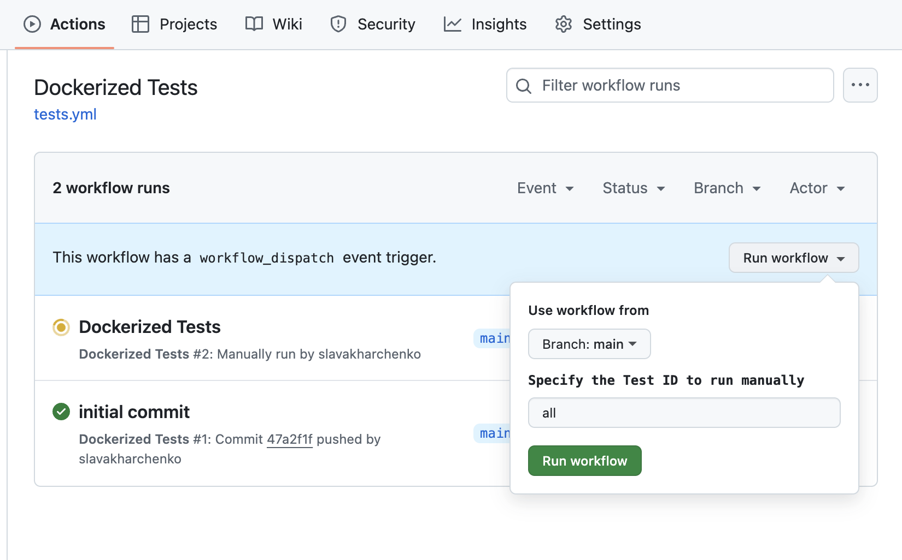
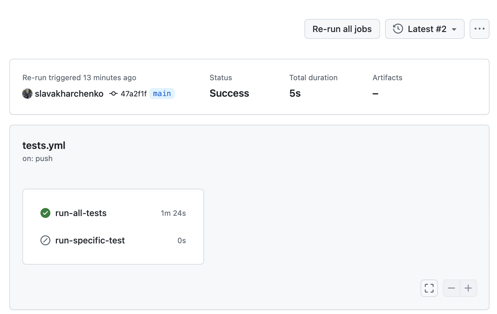
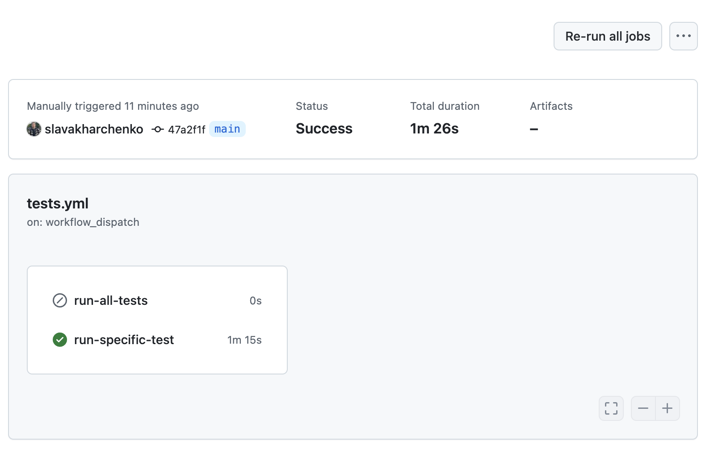

# Test run:

### Run using docker

```bash
# Build image
docker build -t py .

# Run specific test by id
docker run -v $(pwd)/reports:/app/reports -e $TEST_ID py 

# Run all test
docker run -v $(pwd)/reports:/app/reports py
```

### Run locally
```bash
# Create venv, example for macOs
python3 -m venv venv
source venv/bin/activate 

# Run python libraries
pip install --no-cache-dir --upgrade pip && pip install --no-cache-dir -r requirements.txt

# Install Playwright browsers and dependencies
playwright install-deps
playwright install chromium

# Run tests
pytest
```


### Run using Github Action

#### Run workflow


#### In case you run all tests you use run-all-tests job


#### In case you run one specific test you use run-specific-test job
